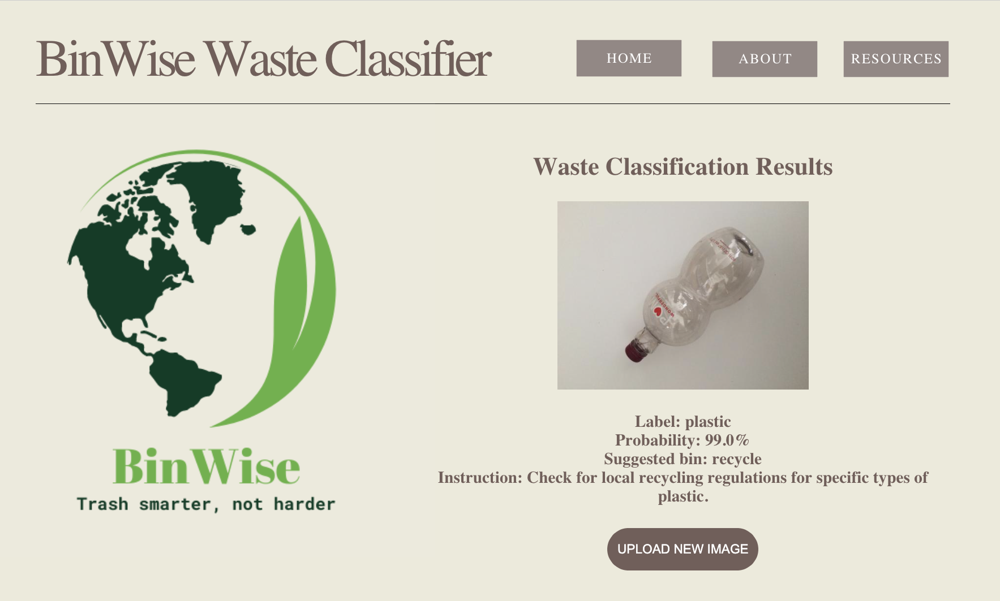

# Waste Classifier App
The BinWise Waste Classifier App is an application that helps users in California to sort their waste into the appropriate bins. The app uses image recognition technology to analyze photos of waste and suggests the appropriate bin for disposal. This application aims to reduce environmental degradation and increase the efficiency of the waste management system in California.

## Technologies Used
- Python
- Flask
- AWS Elastic Beanstalk
- Torch vision model for image classification

## Files
The repository contains the following files:

- application.py - Python code for the Flask web application
- Object.py - Python code for the object class
- prediction.py - Python code for the prediction algorithm
- requirements.txt - List of required Python packages
- templates/ - Folder containing HTML templates for the app
  - templates/results.html - HTML template for the results page
  - templates/upload.html - HTML template for the upload page
  - templates/about.html - HTML template for the about page
  - templates/resourcese.html - HTML template for the resources page
  - templates/home.html - HTML template for the home page
- densenet121_0cpu.pth - File containing the machine learning model used for prediction

## Deployment
The web application is deployed using AWS Elastic Beanstalk. To deploy the application, follow the steps below:
### Prerequisites
Before deploying the application, ensure that you have the following:
- AWS account with appropriate permissions to create an Elastic Beanstalk environment and S3 bucket.
- AWS Command Line Interface (CLI) installed and configured on your local machine.
- Git installed on your local machine.

### Steps
1. Clone the repository: 
  $ git clone https://github.com/c-macmillan/TrashDetectionApp
2. Change directory to the project root:
  $ cd TrashDetectionApp
3. Initialize your EB CLI repository with the eb init command:
  $ eb init -p python-3.8 flask-tutorial --region us-west-1
4. Create an environment and deploy your application to it with eb create:
  $ eb create flask-env -i t3.2xlarge
5. When the environment creation process completes, open your website
  $ eb open

## Usage
To use the application, follow these steps:

1. Visit the app's homepage: http://flask-env.eba-mh47pa6v.us-west-1.elasticbeanstalk.com/
2. Click on the "UPLOAD" button to upload a photo of waste.
3. Click on the "CLASSIFY" button.
4. Wait for the app to analyze the photo, classify the detected item (cardboard, compost, glass, metal, paper, plastic, or trash), suggest the appropriate bin (compost, recycle, or landfill) for disposal, and provide additional instructions.
5. Follow the instructions and dispose your waste in the suggested bin.

### Example
Below is an example of an image to upload to the app:

Here is an example of the suggestion for the uploaded image:

## References
- https://arxiv.org/pdf/1608.06993.pdf
- https://www.kaggle.com/code/keycdy/pytorch-garbage-translearing-ensemble-test-99-67

