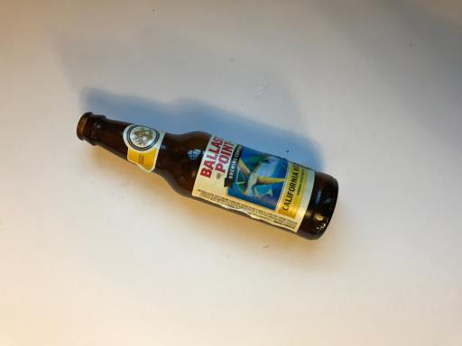

# RAW Waste Sorting App
The RAW Waste Sorting App is an application that helps users in California to sort their waste into the appropriate bins. The app uses image recognition technology to analyze photos of waste and suggests the appropriate bin for disposal. This application aims to reduce environmental degradation and increase the efficiency of the waste management system in California.

## Technologies Used
- Python
- Flask
- Google Cloud Platform App Engine
- Torch vision model for image classification

## Files
The repository contains the following files:

- 404.html - Error page
- app.yaml - Configuration file for Google Cloud Platform App Engine
- index.html - Homepage of the app
- main.py - Python code for the Flask web application
- Object.py - Python code for the object class
- prediction.py - Python code for the prediction algorithm
- requirements.txt - List of required Python packages
- templates/ - Folder containing HTML templates for the app
  - templates/results.html - HTML template for the results page
  - templates/upload.html - HTML template for the upload page
- densenet121_0cpu.pth - File containing the machine learning model used for prediction

## Deployment
The app is deployed using Google Cloud Platform App Engine. To deploy the app:

- Set up a GCP account and create a new App Engine project.
- Install the Google Cloud SDK and authenticate with your GCP account.
- Clone this repository to your local machine.
- Navigate to the repository directory and run gcloud app deploy to deploy the app.

## Usage
To use the application, follow these steps:

1. Visit the app's homepage: https://trashclassifierapp.uw.r.appspot.com/
2. Click on the "Choose file" button to upload a photo of waste.
3. Click on the "Classify" button.
4. Wait for the app to analyze the photo and suggest the appropriate bin for disposal.
5. Dispose your waste in the suggested bin.

### Example
Below is an example of an image to upload to the app:

Here is an example of the suggestion for the uploaded image:

